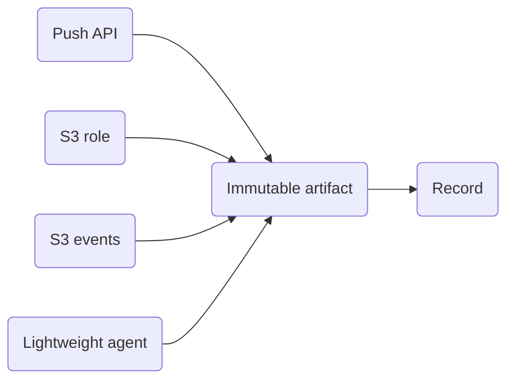

Tacit already reads mail, meetings, documents, and chat. This page is for records those tools do not reach. You can [push them](/api/) from a system you run, or let Tacit read them from [Amazon S3](/s3/).

Either way, your team gets one record instead of a second copy of the same work sitting in another tool. A ticket your app already tracks, and a file that already lives in a bucket, can both become knowledge your people and agents can search.

Push and S3 use the same identity, the same storage rules, and the same processing after the bytes land. The machine-readable push contract is [openapi.yaml](/docs/openapi.yaml).

## What you get from a record

The file stays a file. What you use afterward is the knowledge Tacit writes from it: entities, claims, and links your organization can reuse.

For every accepted record, Tacit:

1. Stores the bytes once and keeps a pointer. The queue carries that pointer, the identity, and a content hash. It does not carry the file, so customer content stays out of job logs.
2. Treats the record as one item inside your organization: source, type, and the stable id you already use. You do not maintain a second id just for Tacit.
3. If the same id arrives again with the same bytes, records who saw it and stops. You do not pay to extract the same note twice.
4. If the same id arrives with new bytes, keeps the id and refreshes the item, so an updated contract replaces the old reading instead of becoming a duplicate.
5. Decides whether the record is noise, matches it to your catalog, and writes the knowledge it can support. An ambiguous match waits for a person.

You can ask for the status of a record at any time. The status names the stage and the outcome, which is what a security or operations review usually needs. It does not return the file, and it does not return the derived knowledge.

## Rules for every path

A record is `organization + source + type + id`. The id is yours: a ticket number, a message id, or an object key. Tacit does not invent one. The organization comes from the credential, never from a field in the body, so a caller cannot point a record at another customer.

A hash of the bytes says whether the content changed. The id stays stable across versions, which is how two mailboxes of one thread, or two exports of one ticket, stay one record.

Delivery is at-least-once. Clients, S3 notifications, and the agent may retry. Tacit deduplicates on the identity and the content hash. A retried call with the same idempotency key returns the original acceptance. Reusing that key with a different payload is rejected, so a bug in the client cannot silently overwrite a record.

A new delivery writes a new object. Tacit does not overwrite bytes in place. If you need to reprocess, Tacit reads the stored object again. You do not have to push a second time. The cursor that tracks progress lives in Tacit.

Records with different ids can be processed in any order. Two versions of the same id follow `seen_at`, then version. A backfill and a live event use the same path. `seen_at` is when the source says it happened. `ingested_at` is when Tacit accepted it.

TLS covers every hop. Objects are encrypted at rest. If the object stays in your bucket, your key decrypts it. If Tacit holds a copy, that copy uses a key dedicated to your organization.

An ingest credential can submit records and read their processing status. It cannot read your knowledge, other organizations, or employee data outside the scope you set. Tacit logs the identity, the hash, the size, the key id, and the outcome. It does not log the file contents, and it does not put the file in an error message.

Landing objects follow the retention period you agree. Removing a record writes a tombstone. Deleting the stored bytes is a separate job, so a status change does not erase the file by accident.

If you attach a person to a record, that person must already belong to your organization. The access list is captured when Tacit accepts the record.

## Where derived knowledge is stored

Files can stay in your bucket. Claims, entities, and embeddings are what your team actually uses, and in the standard deployment Tacit stores them. Keeping that derived record in your account is a later option, described on the [S3 page](/s3/). Say which you need before rollout. The interface stays the same. The processing location is what changes.

## What we need from you

For push, send the `source` names you will use, who can create and revoke ingest keys, whether people (`member_id`) will be attached and how they map to your directory, the volume you expect, and how long the stored bytes should be kept.

For S3, send the account, region, bucket, and prefix, whether versioning is on, the encryption (SSE-S3 or your CMK, and the key ARN if Tacit must decrypt), the mode (role, events, or agent), the size cap and any prefixes or suffixes to skip, and whether a sidecar will supply business ids or the object key is the id.

For either path, confirm where derived knowledge should live, in Tacit or in your account, and share a few dozen representative records you have permission to process. That sample is how identity and exclusion rules get checked before a full backfill.
